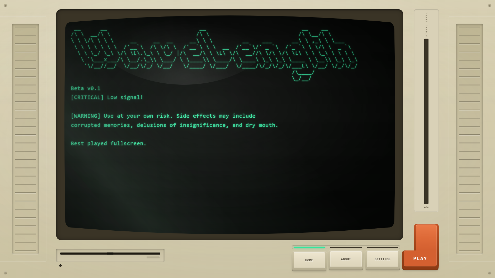

# WaveLength

**A recursive puzzle game about signal processing.**

Wire together chips to transform waveforms into target outputs. Every puzzle you solve becomes a new chip you can use in harder puzzles.

Inspired by signal chains in Digital Audio Workstations. Built entirely with AI-assisted development ([Claude Code](https://claude.ai/claude-code)) in 11 days.

**[Play it live](https://ericmchavez.github.io/WaveLength)**


## How to Play

You're given input waveforms on the left and target waveforms on the right. Place chips on the board, wire them together, and transform the inputs to match the targets.

Start simple. The early levels teach you what each chip does. The later levels require you to combine everything you've learned, sometimes using chips you built from previous puzzles.

## Features

- **Custom game engine** -- Canvas 2D rendering with a 66x36 grid system, A* wire routing, and theme-driven token architecture
- **Node-based editor** -- Place, wire, rotate, and configure signal processing chips on a full-screen canvas gameboard
- **Waveform visualization** -- Three-channel analog meters with live polyline graphs, level bars, and needle indicators across 256 sample cycles
- **Recursive chip system** -- Completed puzzles bake down into reusable chips. Chips contain chips contain chips. It's turtles all the way down
- **Real-time validation** -- All 256 cycles recompute instantly on every edit. No run button, no waiting
- **Animated transitions** -- Zoom into chips to edit their internals, zoom back out when done. Clamshell lid-open animations with spring easing
- **Dual themes** -- Dark (Signal Bench) and light (Studio Monitor)
- **2,300+ tests** across 150+ suites

## Tech Stack

| | |
|---|---|
| Language | TypeScript (strict mode) |
| Rendering | Canvas 2D API |
| State | Zustand |
| UI shell | React 19 |
| Build | Vite |
| Tests | Vitest |

No game frameworks. The engine, renderer, graph evaluator, wire router, and animation system are all written from scratch.

## Run Locally

```bash
git clone https://github.com/ericmchavez/WaveLength.git
cd WaveLength
npm install
npm run dev
```

## Architecture

```
src/
  engine/       Pure TS: graph evaluation, topological sort, formula baking
  gameboard/    Canvas rendering, meters, animation, interaction
  store/        Zustand slices (10+), persistence, state management
  shared/       Grid system, A* routing, theme tokens, math
  puzzle/       Level definitions, waveform generators, validation
  ui/           React overlays (palette, parameters, context menu)
  simulation/   Cycle runner (auto-recomputes on graph changes)
```

The engine is framework-agnostic pure TypeScript. React handles overlays and controls. Canvas handles all gameboard rendering. Zustand is the sole communication bus between them. Draw functions never touch global state -- they receive everything as parameters.

## License

MIT
