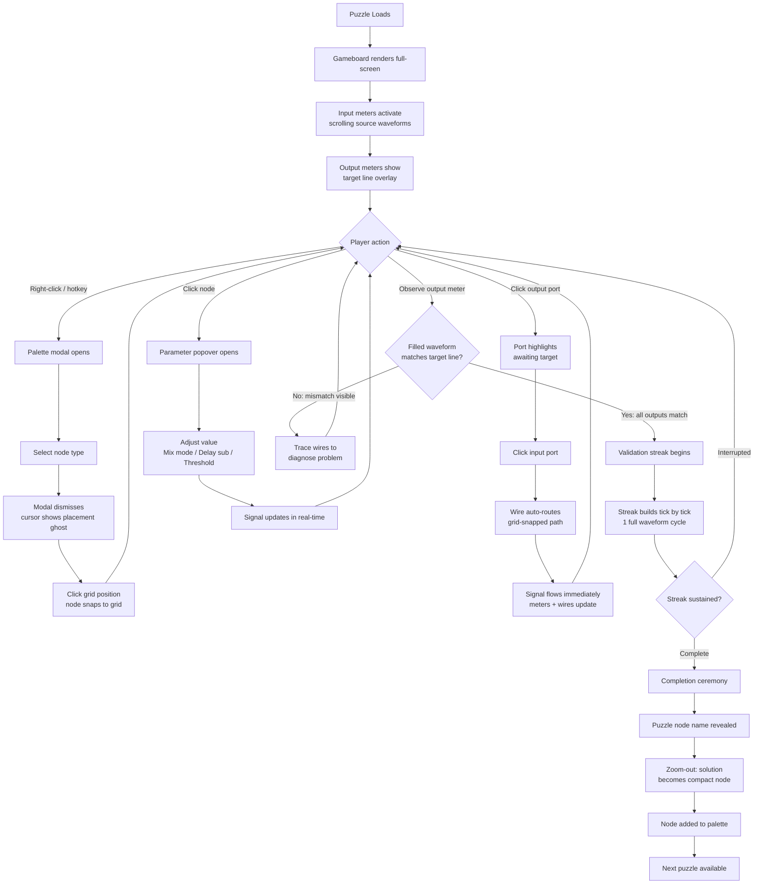
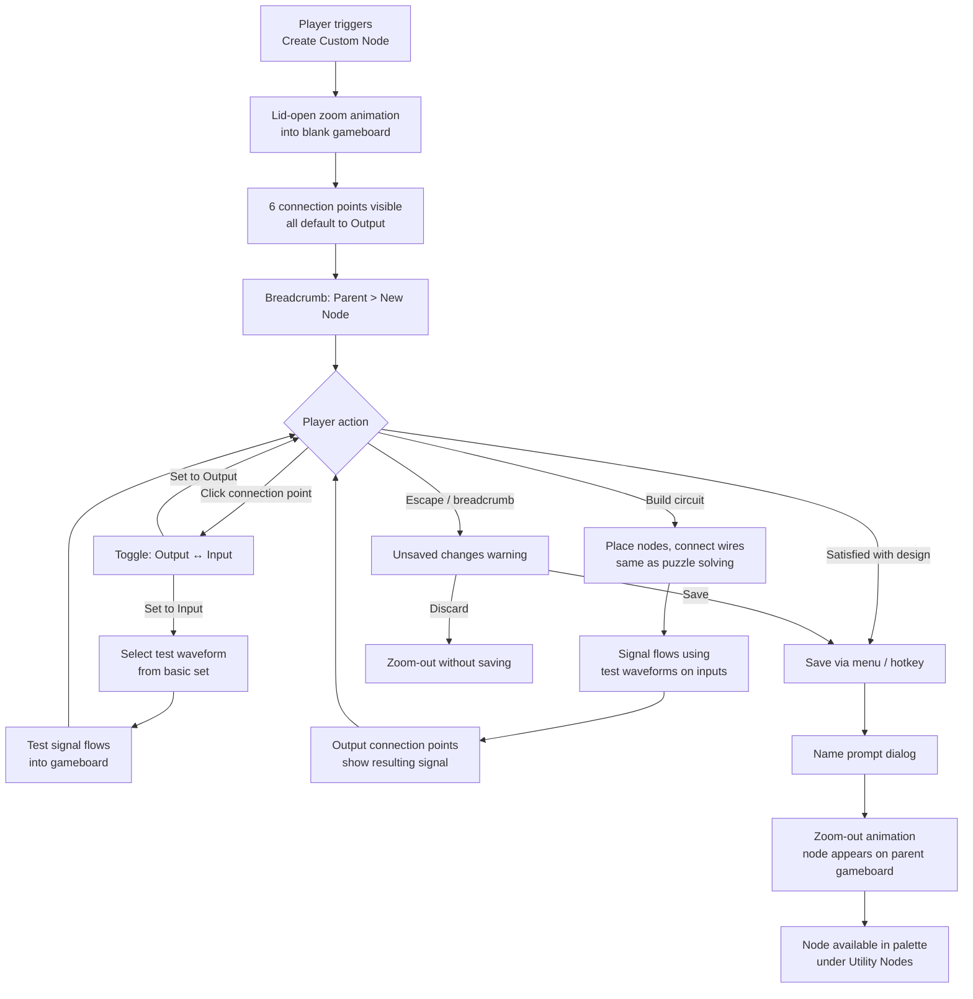
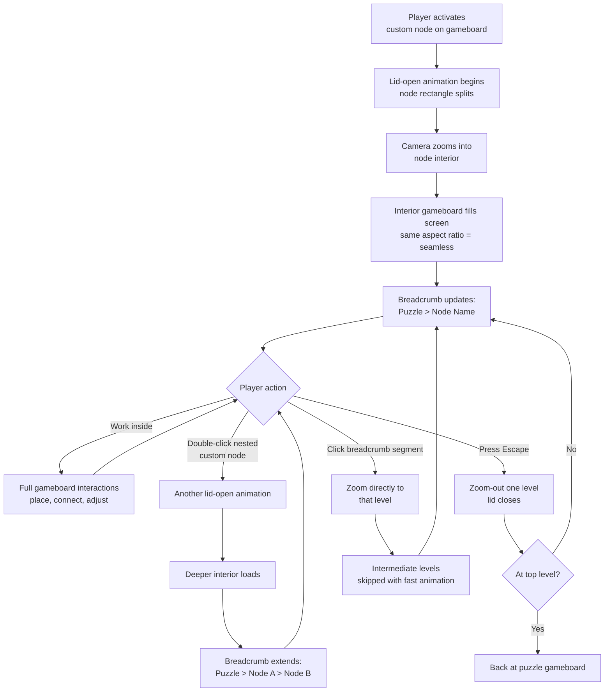
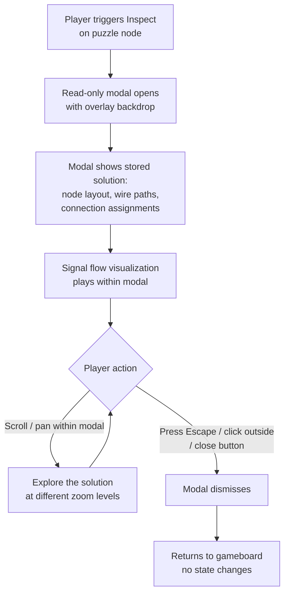
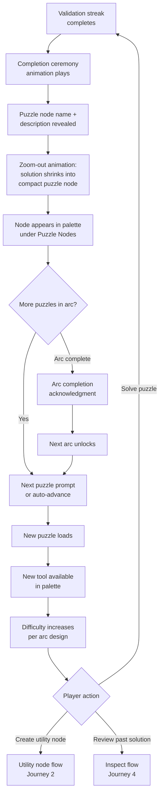

# UX Design Specification logic-puzzle

**Author:** Eric Chavez
**Date:** 2026-02-03

---

## Executive Summary

### Project Vision

A signal processing puzzle game where players connect nodes to transform input waveforms into target outputs. Every solved puzzle becomes a reusable node -- a recursive, fractal tool-building experience inspired by DAWs and node-based visual scripting. The game is fully implemented (4 epics, 26 stories complete) using Canvas 2D + React 19 + Zustand. This UX redesign focuses on improving how signals are communicated to the player and enforcing cleaner spatial organization on the gameboard.

### Target Users

Puzzle game players who appreciate visual/audio processing concepts. Likely somewhat technical or musically inclined, comfortable with node-graph metaphors (DAWs, Unreal Blueprints, Blender Shader Nodes). Playing on desktop web browsers. Intermediate skill level expected -- the game teaches signal processing concepts through play.

### Key Design Challenges

- **Signal readability at a glance** -- The current waveform-only connection points may not communicate signal levels intuitively. The proposed meter redesign addresses this by providing three redundant visual channels per connection point: needle position, level bar fill, and scrolling waveform.
- **Spatial organization on the gameboard** -- Free-form wire placement can create visual chaos. Grid snapping and constrained wire routing (horizontal, vertical, or 45-degree segments only; no 90-degree bends) would enforce clean, readable layouts.
- **Consistent aspect ratio for custom nodes** -- Custom nodes matching the gameboard's aspect ratio reinforces the recursive "every node is a gameboard" concept visually, but requires careful sizing so nodes don't dominate the grid.
- **Wire readability** -- Wires should be colored to illustrate the waveform they carry, combined with grid-snapped routing for clear signal flow visualization.

### Design Opportunities

- **The meter as a signature visual element** -- The analog needle + level bar + scrolling waveform combo is distinctive and thematic. It could become the game's visual identity, reinforcing the DAW/audio-processing inspiration.
- **Grid as a teaching tool** -- Snap-to-grid constrains the design space in ways that help players think more clearly about signal routing, turning a cosmetic choice into a gameplay advantage.
- **Zoom transitions leveraging aspect ratio** -- Since custom nodes match the layout aspect ratio, zoom-in/out animations become geometrically clean -- the node rectangle expands seamlessly into the full gameboard view.

## Core User Experience

### Defining Experience

The core experience is **building signal processing chains and immediately understanding the result through rich, multi-channel visual feedback**. The redesign elevates three aspects of this loop:

1. **Abstraction communication** -- Custom nodes share the gameboard's aspect ratio so that zoom-in/out animations can show a "lid opening" to reveal the node's interior seamlessly. Puzzle nodes are non-editable and resize to fit their actual port count, with a read-only inspect modal for reviewing past solutions.
2. **Signal path readability** -- Wires follow auto-routed, grid-snapped, circuit-board-trace routing (horizontal, vertical, or 45-degree segments; no 90-degree turns) so players can read the waveform being carried along the wire path.
3. **Signal state at a glance** -- Each active connection point is an analog meter instrument with needle, level bar, and scrolling waveform, providing three redundant visual channels for the current signal state.

### Platform Strategy

- **Desktop web browser** -- Mouse/keyboard primary input
- **Full-screen Canvas 2D gameboard** with no persistent UI chrome -- palette and menus are modals or tooltip context menus to avoid breaking immersion
- **Grid-based layout** -- All nodes and wire waypoints snap to the gameboard grid
- **No offline requirement** -- localStorage persistence is sufficient

### Effortless Interactions

- **Signal understanding should require zero conscious effort.** The meter's needle, level bar, and scrolling waveform make signal state obvious at a glance without hovering or inspecting.
- **Waveform scroll direction encodes signal role automatically.** Input meters scroll toward the graph (upcoming source signal); output meters scroll away (actual produced output). This works regardless of whether the meter is on the left or right side.
- **Zoom transitions should feel spatial and continuous.** The lid-open animation on aspect-ratio-matched custom nodes makes entering/exiting feel like physically opening a component, not a screen transition.
- **Wire routing is automatic.** The player clicks an output port then an input port, and the game auto-routes a clean grid-snapped path. The player focuses on *what* to connect, not *how* to route.
- **The gameboard is the entire screen.** No persistent sidebars or menus. Node placement, palette browsing, and settings are accessed through modals and context menus, then dismissed. Full immersion in the graph.

### Critical Success Moments

- **"I can see exactly what my graph is doing"** -- The moment the player looks at the meters and wires and instantly understands signal flow without running a mental simulation.
- **"Opening a node feels like looking inside"** -- The lid-open zoom animation on a same-aspect-ratio custom node makes the abstraction hierarchy tangible.
- **"My wires look like a circuit board"** -- Clean auto-routed grid paths with visible waveform coloring make the player feel like an engineer building something real.
- **"The target is right there on my output"** -- The unfilled target waveform line overlaid on the filled actual output waveform gives continuous comparison feedback at output meters.
- **"I can review how I solved that"** -- The read-only inspect modal on puzzle nodes lets the player revisit and learn from past solutions without breaking the node's compact footprint.

### Experience Principles

1. **Signal state is always visible, never hidden.** Every active connection point broadcasts its current value through needle, bar, and waveform simultaneously. No hover-to-inspect, no hidden state.
2. **Direction encodes role.** Waveform scroll direction on meters is driven by whether the connection point is input or output (per-puzzle configuration), not by left/right position. Signal flow is always readable.
3. **Abstraction is spatial, not symbolic.** Zooming into a custom node is a physical camera movement into a same-shaped space with a lid-open animation. Puzzle nodes are compact and inspectable via modal.
4. **Constraints enable clarity.** Grid snap, wire routing rules, and auto-routing exist to make layouts readable, not to restrict creativity.
5. **Immersion over chrome.** No persistent UI elements. The gameboard canvas is always full-screen. Palette, menus, and controls appear as modals/context menus when needed, then disappear.

### Connection Point Behavior

Connection point directionality is **per-puzzle, not per-side**. A puzzle definition dictates which of the 6 possible connection points (3 left, 3 right) are active and whether each is input or output.

| Context | Connection Point Defaults | Behavior |
|---------|--------------------------|----------|
| Puzzle gameboard | Per puzzle definition (input/output assignment varies) | Only active meters are rendered; unused connection points are hidden |
| Custom node gameboard | All connection points start as outputs | Player can click a connection point to switch it to input and select a basic test waveform |

### Waveform Display Rules

| Element | Actual Signal | Target Signal |
|---------|--------------|---------------|
| Waveform area | Polarity-colored fill between 0 and value | Line/curve only (not filled) |
| Needle | Shows actual level | Not shown |
| Level bar | Shows actual level with polarity color | Not shown |

| Connection Point Role | Scroll Direction | What It Shows |
|----------------------|-----------------|---------------|
| Output (source into graph) | Toward needle / toward graph | Upcoming signal -- what the graph will receive next |
| Input (receiving from graph) | Away from needle / away from graph | Actual received levels -- what the graph produced |

### Wire Routing Rules

Inspired by circuit board trace patterns:

1. Wires can align with vertical gridlines, horizontal gridlines, or 45-degree diagonals
2. Wires must connect to connection points on the horizontal (enter/exit ports horizontally)
3. Wires cannot make 90-degree turns (must use 45-degree transitions between H and V segments)
4. Wires display the waveform they carry using polarity-colored fill, readable along the path
5. Wires are auto-routed -- the player selects source and target ports; the game computes a valid path avoiding overlap with other nodes and wires where possible

### Node Display Rules

| Node Type | Shape | Aspect Ratio | Editable | Zoom Animation | Sizing |
|-----------|-------|-------------|----------|----------------|--------|
| Custom (utility) | Gameboard aspect ratio | Matches screen | Yes (zoom-in with lid open) | Lid-open → camera zoom into interior | Fixed (gameboard ratio) |
| Custom (puzzle, earned) | Compact rectangle | Fits active ports | No (read-only inspect modal) | None (modal overlay for inspection) | Dynamic (resized to port count) |
| Fundamental | Compact rectangle | Minimal | No | None | Fixed (minimal footprint) |

### UI Strategy

- **Node palette** -- Modal or context menu triggered by right-click / hotkey on empty gameboard space. Browse and select node to place. Dismissed after selection.
- **Node parameters** -- Tooltip/popover on the node itself when clicked. Adjust Mix mode, Delay subdivision, Threshold value in-place.
- **Puzzle node inspection** -- Read-only modal showing the stored internal layout (node positions, wire paths) of a previously solved puzzle. View only, no modification.
- **Breadcrumbs** -- Minimal overlay showing nesting depth, read-only. Only visible when inside a nested custom node.
- **No persistent sidebar or toolbar** -- The gameboard canvas is always 100% of the screen.

## Desired Emotional Response

### Primary Emotional Goals

- **Workshop tinkering** -- The player should feel like they're at a workbench, hands-on with physical instruments. Experimenting, adjusting, observing results. Not "using software" but "building something with tools."
- **Iterative discovery** -- The core emotional loop is: curiosity ("what if?") → observation ("not quite right") → insight ("I see the problem!") → anticipation ("is it going to match?") → satisfaction ("it works!"). The UI must support every beat of this loop with immediate, readable feedback.
- **Analog precision in a modern shell** -- The game should feel like a high-end piece of audio equipment: physical knobs and needles that respond with satisfying immediacy, housed in a sleek, modern interface. Vintage soul, contemporary skin.

### Emotional Journey Mapping

| Stage | Player Feeling | UX Support |
|-------|---------------|------------|
| **First encounter** | Intrigue, curiosity | Dark premium aesthetic invites exploration; meters and needles are immediately visually interesting before the player understands the mechanics |
| **Early tinkering** | Playful experimentation | Low-friction node placement and auto-wired connections let the player try things quickly; meters respond instantly so every change has visible feedback |
| **Diagnosing a problem** | Focused concentration | The three-channel meters (needle, bar, waveform) let the player read signal state without switching views; circuit-board wire paths make signal flow traceable |
| **Eureka moment** | Sharp insight, excitement | The player spots the mismatch between actual (filled waveform) and target (line overlay) on the output meter -- the problem becomes visually obvious |
| **Watching validation** | Rising anticipation | The streak counter builds as all outputs match; the player watches the meters confirm correctness tick by tick -- wanting to hold their breath |
| **Puzzle completion** | Pride, earned power | The ceremony reveals the node name; the zoom-out shows their solution becoming a tool. They built something real |
| **Using earned tools** | Compounding mastery | Placing a previously-earned puzzle node on a harder puzzle and watching it work inside the larger chain. The fractal depth becomes tangible |
| **Zooming into a node** | Wonder, spatial awareness | The lid-open animation reveals the internals -- the player sees the recursive structure physically. "My Rectifier is made of these parts" |

### Micro-Emotions

| Desired | Avoided | Design Lever |
|---------|---------|-------------|
| **Confidence** -- "I understand what's happening" | **Confusion** -- "I can't tell what this signal is" | Multi-channel meters make signal state redundantly clear |
| **Anticipation** -- "Is this going to work?" | **Anxiety** -- "I might break something" | Undo/redo and non-destructive experimentation remove fear |
| **Satisfaction** -- "I built this and it works" | **Frustration** -- "Why isn't this working and I can't tell why" | Real-time per-port match feedback; target overlay on output waveform |
| **Precision** -- "This feels like a real instrument" | **Cheapness** -- "This feels like a toy" | Premium DAW aesthetic; physical-feeling meters with needle response; metallic/depth finishes |
| **Flow** -- "I'm fully immersed" | **Interruption** -- "The UI keeps getting in my way" | No persistent chrome; full-screen gameboard; modals dismiss cleanly |

### Design Implications

**Visual tone derived from DAW inspiration (Quanta, LANDR Mastering, Elysium, DS Sitar):**

- **Dual theme support: dark and light** -- Dark theme as default (deep charcoal/near-black, per Quanta/LANDR/DS Sitar references). Light theme as alternative (warm or cool light gray, per Elysium reference). Both themes preserve depth through shadows, gradients, and metallic finishes on interactive elements. Neither theme should feel flat.
- **Light mode considerations** -- In light mode, waveform fills and wire colors need sufficient contrast against the lighter background. The grid may shift from lighter-on-dark to subtler-on-light. Meters and nodes retain their physical depth (drop shadows, bevels, metallic knob finishes) regardless of theme. The Elysium reference is the baseline: silver/metallic controls on a light gray surface, with colored accents for functional data.
- **Theme-agnostic accent colors** -- Polarity colors must read clearly on both dark and light backgrounds. This likely means the specific hue/saturation values shift between themes, but the semantic meaning (positive = one color, negative = another) stays consistent.
- **CSS custom properties as the mechanism** -- Already in the architecture (project-context.md confirms "CSS custom properties for theming"). Theme switching swaps a set of custom property values; no structural CSS changes needed.
- **Accent colors are functional, not decorative** -- Polarity colors (positive/negative signal) serve as the primary accent palette. Warm tones for positive, cool tones for negative (or vice versa -- to be defined in visual design). The Quanta orange and LANDR teal are reference points.
- **Subtle depth, not flat** -- Knobs, nodes, and meters should have gentle shadows, gradients, or metallic finishes that give them physical weight in both themes. Reference: Elysium's silver knobs, the DS Sitar's brushed-metal central dial.
- **Clean typography** -- Sans-serif, well-spaced labels. Node names, parameter values, and breadcrumbs should be legible but understated. The interface is the meters and wires, not the text.
- **Waveform displays as hero elements** -- The scrolling waveforms on meters and the waveform coloring on wires are the primary visual content of the screen. They should be beautifully rendered, smooth, and satisfying to watch.

### Emotional Design Principles

1. **Every interaction gives immediate physical feedback.** Needles swing, bars fill, waveforms scroll. Nothing feels laggy or abstract. The game is an instrument, not a form.
2. **The canvas makes signals the star.** Background recedes (dark or light); waveform colors, needle positions, and wire traces carry all the information. The player's eyes go to the data, not the chrome.
3. **Anticipation is a feature, not a bug.** The validation streak building tick-by-tick is deliberately suspenseful. The UI should let the player watch this play out without rushing it.
4. **Earned complexity feels like power, not burden.** Each new puzzle node is a tool the player built. Using it later should feel like wielding something they understand deeply, reinforced by the inspect modal showing "I made this."
5. **Premium feel earns trust.** A polished, DAW-quality visual aesthetic signals that the game takes its subject seriously. Players invest more effort in a game that looks like it respects their intelligence.

## UX Pattern Analysis & Inspiration

### Inspiring Products Analysis

**Zachtronics -- Opus Magnum & SHENZHEN I/O (Tinkering Loop & Engineering Feel)**

- **What they nail:** The build-then-watch cycle. You construct your solution, then hit Run and watch it execute. The watching *is* the reward -- you see your machine work (or fail) in real time. This is directly analogous to the validation streak.
- **Open-ended solutions** -- Multiple valid approaches to each puzzle. The game doesn't judge *how* you solved it, just *that* you solved it. Encourages experimentation over rote optimization.
- **Debugging is visual** -- In SHENZHEN I/O, you watch signals flow through your circuit. In Opus Magnum, you watch arms move. The player diagnoses problems by observing behavior, not reading error messages. The meters serve this same function.
- **Constraints as creative fuel** -- Limited workspace, limited components. The grid and routing rules serve the same purpose: constraints that focus creativity rather than limiting it.
- **Satisfaction of compactness** -- Players naturally want to make solutions elegant. Grid-snapped, circuit-board-trace routing will feed this instinct.

**Rail Route & Linkito (Wire Aesthetics & Routing Clarity)**

- **What they nail:** Wires/tracks as visual storytelling. The paths themselves communicate flow, direction, and purpose without labels. You can read the system by looking at the routing alone.
- **Rail Route** -- Clean, organized track layouts where the routing pattern *is* the game. The player reads the state of the system through track topology. Color and thickness encode meaning. The organized routing makes complex systems readable at scale.
- **Linkito** -- Illustrative, beautiful connections that make the act of connecting feel satisfying in itself. The visual quality of the wires elevates a simple action (connecting two points) into something that feels crafted.
- **Key lesson:** Wire quality is not cosmetic -- it's the primary way the player reads their own design. Investing in beautiful, readable wire rendering pays off in comprehension and satisfaction.

**DAW Plugins -- Quanta, LANDR Mastering, Elysium, DS Sitar (Visual Tone & Physical Feel)**

- **What they nail:** Premium, physical-feeling interfaces in a digital medium. Knobs that feel like they have weight. Meters that respond with analog smoothness. Dark themes that make data pop.
- **Depth without skeuomorphism** -- None of these try to look like photographs of hardware. They use subtle shadows, gradients, and metallic hints to suggest physicality without being literal. This is the target for meters and nodes.
- **Functional color** -- Color is used sparingly and always means something (signal level, frequency band, active state). Decorative color is minimal. The polarity color system follows this same principle.
- **Elysium as light-theme proof** -- Demonstrates that a lighter palette can still feel premium and physical with metallic knobs, subtle shadows, and clean spacing. Validates the dual-theme approach.

### Transferable UX Patterns

**Build-then-Watch (from Opus Magnum / SHENZHEN I/O)**
- Player constructs a solution, then observes it run in real time
- The validation streak is the game's version of this -- the player watches meters confirm correctness tick by tick
- The anticipation during the watch phase is the emotional peak
- Applies to: validation flow, meter animation, puzzle completion ceremony

**Visual Debugging (from SHENZHEN I/O)**
- The player diagnoses problems by observing signal behavior, not reading logs
- The three-channel meters (needle, bar, scrolling waveform) are a richer version of this
- Target overlay (line) vs actual (fill) on output waveforms makes the mismatch visually obvious
- Applies to: meter design, wire waveform coloring, connection point feedback

**Illustrative Routing (from Rail Route / Linkito)**
- Wires/tracks are the primary visual language of the system
- Clean organized paths communicate system state without labels
- The beauty of the routing itself creates satisfaction and pride
- Applies to: auto-routed circuit-board-trace wires, waveform-colored wire fills, grid snap

**Physical Depth in Digital (from DAW references)**
- Subtle shadows, gradients, metallic finishes suggest physical instruments
- Works in both dark and light themes (Quanta vs Elysium)
- Color is functional (signal data), not decorative
- Applies to: meter rendering, node surfaces, knob/parameter controls, dual-theme support

**Constraint-Driven Elegance (from Zachtronics games generally)**
- Limited workspace and strict rules produce emergent creativity
- Players naturally pursue compact, elegant solutions when constraints are clear
- Grid snap + wire routing rules will encourage this behavior organically
- Applies to: grid system, wire routing rules, connection point limits (3 per side)

### Anti-Patterns to Avoid

- **Invisible state** -- Requiring hover or click to reveal signal values. If the player has to inspect to understand, the meters have failed. (Anti-example: node-graph tools that show values only on hover.)
- **Spaghetti wires** -- Allowing free-form wire routing that becomes unreadable at scale. Rail Route and Linkito succeed precisely because their connections are organized. Grid-snapped auto-routing prevents this.
- **Modal overload** -- Since the palette and menus are now modals, they must be lightweight and quick to dismiss. If opening the palette feels like navigating a settings screen, it will break flow. Keep modal interactions snappy.
- **Premature celebration** -- Triggering the completion ceremony too eagerly or interrupting the player's observation moment. The build-then-watch phase (validation streak) needs to breathe. Let the anticipation build.
- **Generic flat UI** -- Flat, material-design-style interfaces lack the physical depth that supports the "workshop tinkering" feeling. The DAW references all use subtle depth. Avoid the trap of making it "clean" at the expense of physical feel.
- **Cluttered information density** -- SHENZHEN I/O can be overwhelming for newcomers due to information density. The three-channel meter design gives redundant readings, but the overall screen should still feel spacious -- the full-screen gameboard with no persistent chrome helps here.

### Design Inspiration Strategy

**What to Adopt:**
- Build-then-watch validation loop (Zachtronics) -- the streak counter is the "run" phase
- Visual debugging through signal observation (SHENZHEN I/O) -- meters replace error messages
- Illustrative wire rendering as primary visual language (Rail Route, Linkito) -- waveform-colored, grid-snapped paths
- Physical depth via subtle shadows/gradients/metallic finishes (DAW references) -- in both themes

**What to Adapt:**
- Zachtronics' replay/optimization culture -- the game already supports re-solving puzzles; the inspect modal lets players review past solutions without the full optimization-loop pressure
- Rail Route's track complexity -- wires carry waveform data (richer than simple tracks), requiring the filled polarity-color rendering along the wire path
- DAW parameter controls (knobs/sliders) -- adapted as in-place tooltip/popovers on nodes rather than persistent panels, to preserve immersion

**What to Avoid:**
- Free-form wire routing from traditional node-graph editors (Unreal Blueprints, Blender) -- conflicts with readability goals
- Persistent sidebars/toolbars from DAW interfaces -- conflicts with full-screen immersion principle
- Information-on-hover patterns from node-graph tools -- conflicts with "always visible" meter principle
- Flat/material UI aesthetics -- conflicts with physical workshop feel

## Design System Foundation

### Design System Choice

**Custom Design Token System (Three-Tier)** -- A lightweight, project-specific set of design tokens implemented as CSS custom properties with a three-tier architecture (Primitive → Semantic → Component), with Canvas rendering sharing cached token values. No third-party component library.

### Rationale for Selection

- **Canvas dominates the visual experience.** ~90% of what the player sees is Canvas-rendered. No design system provides Canvas components -- these are all custom.
- **React UI is minimal.** Only modals, popovers, context menus, and breadcrumb overlays. These are simple enough to build with CSS Modules without a component library.
- **Visual identity is highly custom.** DAW-inspired meters, circuit-board wires, metallic depth finishes -- none of this exists in any design system. It must be hand-crafted.
- **Dual-theme support is already architected.** CSS custom properties for theming are specified in the project context. The three-tier token system formalizes this.
- **Solo developer + AI agents.** No team coordination cost to justify a heavy design system. Tokens provide consistency without overhead.

### Implementation Approach

**Three-Tier Token Architecture:**

| Tier | Purpose | Example | Theme Impact |
|------|---------|---------|-------------|
| **Tier 1: Primitive** | Raw values (colors, sizes, durations) | `--color-amber-400: #f6a623`, `--shadow-dark-md: 0 4px 12px rgba(0,0,0,0.4)` | Themes swap these values |
| **Tier 2: Semantic** | Purpose-driven aliases | `--signal-positive: var(--color-amber-400)`, `--depth-raised: var(--shadow-dark-md)` | References Tier 1; cascades automatically |
| **Tier 3: Component** | Element-specific tokens | `--meter-needle-color: var(--signal-positive)`, `--wire-width: var(--size-wire-base)` | References Tier 2; never changes per theme |

Theme switching only touches Tier 1 definitions. Everything cascades through Tier 2 and Tier 3 automatically.

**State-Aware Token Variants:**

Tokens include interactive and validation state variants, not just static values:

| Base Token | State Variants |
|-----------|---------------|
| `--signal-positive` | `--signal-positive-confirming`, `--signal-positive-mismatch` |
| `--signal-negative` | `--signal-negative-confirming`, `--signal-negative-mismatch` |
| `--surface-node` | `--surface-node-hover`, `--surface-node-selected`, `--surface-node-error` |
| `--depth-raised` | `--depth-raised-active`, `--depth-raised-pressed` |

**Token Categories:**

| Category | Examples | Used By |
|----------|---------|---------|
| **Surface colors** | Background, gameboard, node surface, modal surface | Canvas + CSS |
| **Signal colors** | Positive polarity, negative polarity, neutral, target line, confirming/mismatch states | Canvas primarily |
| **Depth tokens** | Shadow definitions per depth level (surface, raised, sunken, highlight) -- fully redefined per theme, not inverted | Canvas + CSS |
| **Typography** | Font family, sizes (label, value, heading), weights | Canvas text + CSS |
| **Spacing** | Grid cell size, node padding, meter dimensions, port sizes | Canvas primarily |
| **Border/shape** | Border radii (node corners, modal corners), wire width | Canvas + CSS |
| **Animation** | Needle swing speed, waveform scroll rate, transition durations | Canvas + CSS transitions |
| **Interactive states** | Hover, active, selected, error, confirming, mismatch | Canvas hit-test feedback + CSS |

**Depth Palette (Per Theme):**

Each theme defines a complete depth language -- not color inversions but distinct depth definitions:

| Depth Level | Dark Theme | Light Theme |
|------------|-----------|------------|
| **Surface** | Dark charcoal base | Warm/cool light gray base |
| **Raised** | Lighter subtle highlight + soft shadow below | Darker shadow below + bright highlight above |
| **Sunken** | Inner shadow, darker than surface | Inner shadow, slightly darker than surface |
| **Highlight** | Metallic bright edge / gradient | Metallic silver edge / gradient |

**Theme Structure:**

```
:root (dark theme default)
  /* Tier 1: Primitives */
  --color-amber-400: #f6a623;
  --color-teal-400: #2dd4bf;
  --shadow-base: 0 4px 12px rgba(0,0,0,0.4);
  ...

  /* Tier 2: Semantic */
  --signal-positive: var(--color-amber-400);
  --signal-negative: var(--color-teal-400);
  --depth-raised: var(--shadow-base);
  ...

  /* Tier 3: Component */
  --meter-needle-color: var(--signal-positive);
  --wire-width: 3px;
  ...

[data-theme="light"]
  /* Only Tier 1 overrides */
  --color-amber-400: #e89b1a;
  --shadow-base: 0 4px 12px rgba(0,0,0,0.15);
  ...
```

**Canvas ↔ CSS Sync:**

The Canvas renderer does NOT read CSS custom properties at render time (avoids layout thrashing). Instead:

1. On app init and theme switch, all token values are read once from CSS via `getComputedStyle` into a flat `ThemeTokens` TypeScript object
2. The Canvas rAF loop reads `ThemeTokens` alongside Zustand `getState()` each frame -- negligible overhead
3. CSS custom properties remain the source of truth; the TS object is a cached snapshot
4. Theme switch triggers: CSS class/data-attribute swap + `ThemeTokens` cache refresh

**Canvas Rendering Recipes:**

Documented patterns for how tokens combine when drawing Canvas elements -- the design system's implementation guide for Canvas code:

| Element | Recipe |
|---------|--------|
| **Node surface** | Fill `--surface-node` → inner shadow `--depth-sunken` → border stroke `--depth-raised` → label text `--type-color-primary` |
| **Meter needle** | Line from pivot using `--meter-needle-color` → width `--meter-needle-width` → shadow `--depth-raised` for physical weight |
| **Meter level bar** | Fill rect from center outward using `--signal-positive` or `--signal-negative` based on polarity → clipped to bar bounds |
| **Wire trace** | Stroke path `--wire-width` → fill waveform using polarity colors between 0-line and value → path follows grid snap rules |
| **Node (hover)** | Same as node surface but swap `--surface-node` → `--surface-node-hover`, border → `--depth-raised-active` |
| **Validation confirming** | Output meter waveform pulses between `--signal-positive` and `--signal-positive-confirming` as streak builds |

### Customization Strategy

- **No third-party dependencies** for visual components. All UI is built with CSS Modules + the token system.
- **Token values are the single source of truth** for both Canvas and React rendering via the three-tier architecture.
- **New components** inherit from the token system automatically via Tier 2/3 references.
- **Theme switching** swaps Tier 1 CSS primitives + refreshes the Canvas `ThemeTokens` cache. No component re-renders needed.
- **Rendering recipes** document how tokens combine for each Canvas element, ensuring new Canvas drawing code follows established patterns.

## Defining Experience

### The Core Interaction

**"Connect nodes and watch your signal match the target."**

The defining experience is the moment the player looks at their output meter, sees the filled waveform aligning with the target line, and watches the validation streak build. Everything in the redesign serves this moment: the meters make the match/mismatch instantly readable, the wires show how signal flows through the chain, and the grid keeps it all spatially organized so the player can trace cause and effect.

### User Mental Model

**Primary audience: Puzzle gamers.** Players approach this as a logic puzzle, not an audio engineering exercise. They don't bring signal processing knowledge -- they bring puzzle-solving instincts: pattern recognition, trial and error, hypothesis testing.

**Mental model they'll build:** "Signals flow left to right through nodes that transform them. I need to make the output waveform look like the target." The analog meter aesthetic and DAW terminology ("Mix", "Threshold", "Delay") give the game a thematic identity and make players feel like engineers, but comprehension comes from the visuals, not the vocabulary.

**What they bring from other puzzle games:**
- Zachtronics instinct: build something, run it, observe, iterate
- Spatial reasoning from grid-based puzzles
- "Undo is free, experimentation is safe" expectations
- Desire for elegant solutions once the correct one is found

**Where confusion could occur:**
- Timing/delay concepts (WTS subdivisions) are the hardest to visualize -- the scrolling waveforms on meters and animated wire waveforms are critical for making timing tangible
- Recursive nesting ("a node contains a gameboard") -- the lid-open zoom animation is designed specifically to make this spatial rather than abstract
- Understanding what "matching the target" means at first -- the filled-vs-line waveform overlay needs to be immediately legible

### Success Criteria

| Criteria | Indicator |
|----------|----------|
| **Player reads signal state without thinking** | They look at a meter and know the value. No hovering, no number-reading -- needle position and waveform shape communicate instantly |
| **Player traces signal flow visually** | They follow a wire from output to input, reading the waveform color along the path, and understand what signal is being carried |
| **Player identifies mismatch location** | When the output doesn't match, the player can look at the output meter's filled waveform vs target line and pinpoint *what's wrong* -- amplitude? shape? timing? |
| **Player feels the eureka moment** | The "not quite right → I see it → fix it → watch it work" loop completes in seconds, not minutes. The visual feedback is fast enough to support rapid iteration |
| **Player understands nesting on first zoom** | The lid-open animation makes it obvious that "this node contains a gameboard." No tutorial text needed for the concept -- the animation teaches it |
| **Player's layout is readable to them** | Auto-routed grid-snapped wires produce layouts the player can understand even as complexity grows. They don't feel lost in their own design |

### Novel UX Patterns

**What's novel (needs the visuals to teach it):**

- **Three-channel analog meters as connection points** -- No precedent in puzzle games. The meter combining needle + level bar + scrolling waveform is unique. But the components are individually familiar (VU meters, progress bars, oscilloscope traces), so the combination should be parseable without instruction.
- **Waveform-colored wires on grid-snapped routes** -- Combines Rail Route/Linkito's illustrative routing with live data visualization. Players learn to read wire color as "what signal is this carrying" naturally through play.
- **Lid-open zoom into same-aspect-ratio nodes** -- Novel spatial metaphor for abstraction. The animation does the teaching.

**What's established (players already understand):**

- **Click-to-connect wiring** -- Standard node-graph interaction. Click output, click input, wire appears.
- **Grid-based placement** -- Familiar from any grid puzzle or strategy game.
- **Undo/redo** -- Expected, standard.
- **Palette/menu for node selection** -- Familiar from any editor tool.
- **Target-matching as victory condition** -- Standard puzzle mechanic (compare output to goal).

**Bridge strategy:** The novel elements (meters, waveform wires, zoom animation) are all **visual/passive** -- the player doesn't need to learn new *actions*, only new ways of *reading* the game state. The actions they perform (place nodes, connect wires, adjust parameters) are all established patterns. This means the learning curve is perceptual, not mechanical.

### Experience Mechanics

**1. Initiation -- Starting a Puzzle:**
- Puzzle loads with full visual system active from Level 1
- Input meters show upcoming source waveforms (scrolling toward graph)
- Output meters show target as unfilled line overlay
- Empty grid area invites node placement
- Player right-clicks or uses hotkey to open palette modal

**2. Interaction -- Building the Chain:**
- Player selects a node from the palette modal → modal dismisses → click to place on grid
- Click output port → click input port → wire auto-routes along grid with circuit-board-trace path
- Node parameters adjustable via click-to-open popover (Mix mode, Delay subdivision, Threshold)
- Signal flows immediately -- meters and wires update in real time as soon as connections are made
- Every change is undoable (Ctrl+Z)

**3. Feedback -- Reading the Result:**
- Output meters show actual signal (filled polarity-colored waveform) overlaid with target (unfilled line)
- Mismatch is visible instantly: filled area deviates from the target line
- Wire waveform coloring shows what each connection is carrying
- Input meters confirm what's being fed into the graph
- Needle and level bar give at-a-glance amplitude reading for every connection point

**4. Iteration -- The Tinkering Loop:**
- Player observes mismatch → hypothesizes cause ("amplitude is too low" / "timing is off")
- Traces wire path back from the output meter to find where the signal diverges from expectation
- Adjusts node parameter, reroutes a connection, or adds/removes a node
- Signal updates immediately → meters reflect the change → player evaluates again
- Loop repeats until output matches target

**5. Completion -- Validation and Reward:**
- When all output meters match target within tolerance, validation streak begins
- Player watches the streak build tick by tick -- rising anticipation
- After 1 full waveform cycle of sustained match, victory triggers
- Puzzle node name and description revealed
- Compact puzzle node appears in palette -- sized to its port count, inspectable via modal
- Next puzzle loads with the new tool available

## Visual Design Foundation

### Color System

**Polarity Colors (Primary Accent Palette):**

| Signal Value | Color Family | Role | Dark Theme | Light Theme |
|-------------|-------------|------|-----------|------------|
| Positive (+1 to +100) | Warm amber/orange | Signal fill, wire waveform, meter bar (positive side) | Bright amber (high saturation, luminous) | Deeper amber (sufficient contrast on light bg) |
| Negative (-1 to -100) | Cool teal/blue | Signal fill, wire waveform, meter bar (negative side) | Bright teal (high saturation, luminous) | Deeper teal (sufficient contrast on light bg) |
| Neutral (0) | Muted gray | Centerline, resting state, empty signal | Mid gray | Mid gray |
| Target overlay | White / high-contrast | Unfilled line/curve on output meters | White or light gray line | Dark gray or near-black line |

**Surface Colors:**

| Surface | Dark Theme | Light Theme |
|---------|-----------|------------|
| **Gameboard background** | Deep charcoal (#1a1a2e or similar) | Warm light gray (#e8e6e1 or similar) |
| **Grid lines** | Subtle lighter gray (low opacity) | Subtle darker gray (low opacity) |
| **Node surface** | Slightly lighter than gameboard, with depth | Slightly lighter than gameboard, with shadow depth |
| **Meter housing** | Dark panel with metallic edge highlights | Light panel with metallic edge highlights |
| **Modal overlay** | Semi-transparent dark backdrop + elevated panel | Semi-transparent light backdrop + elevated panel |
| **Wire background** | Transparent (waveform fill is the wire) | Transparent (waveform fill is the wire) |

**State Colors:**

| State | Color Approach |
|-------|---------------|
| **Hover** | Subtle brightness increase on surface + highlight border |
| **Selected** | Accent border (polarity-neutral, e.g. a soft white or brand color) |
| **Error** | Desaturated warm red (distinct from positive amber) |
| **Validation confirming** | Pulsing/intensified polarity colors as streak builds |
| **Validation victory** | Bright celebratory burst -- both polarity colors at full intensity |

**Contrast Requirements:**

- Polarity colors must meet WCAG AA contrast ratio (4.5:1) against their respective gameboard backgrounds in both themes
- Node labels must meet AA against node surface
- Modal text must meet AA against modal surface
- Target line must be clearly distinguishable from the polarity-colored fill on meters

### Typography System

**Dual-Font Strategy:**

| Use | Font Type | Style | Examples |
|-----|----------|-------|---------|
| **Labels** | Geometric sans-serif | Clean, modern, well-spaced | Node names ("Mix", "Delay"), palette items, breadcrumbs, modal headings, parameter labels |
| **Signal values** | Monospace | Technical, precise, tabular | Numeric readouts on meters, constant values on connection points, parameter values (-100 to +100), threshold settings |

**Type Scale:**

| Level | Use | Size (relative) |
|-------|-----|-----------------|
| **Heading** | Modal titles, puzzle name reveal | Large |
| **Label** | Node names, palette section headers, breadcrumb segments | Medium |
| **Value** | Parameter values, signal readouts, constant inputs | Medium (monospace) |
| **Caption** | Tooltips, secondary info, keyboard shortcut hints | Small |

**Typography Principles:**

- Labels are understated -- the visual system (meters, wires) carries the information, not text
- Signal values use monospace for tabular alignment and technical feel
- Canvas-rendered text uses the same font families as CSS (loaded via `FontFace` API or preloaded via CSS `@font-face`)
- Font weights: regular for labels, medium/bold for values and headings only
- No decorative or display fonts -- the DAW aesthetic comes from the interface elements, not the typography

### Spacing & Layout Foundation

**Grid System:**

| Property | Value |
|----------|-------|
| **Starting density** | Match wireframe (~20-25 cells across playable area) |
| **Grid cell** | Square cells, uniform size |
| **Snap behavior** | All nodes snap to grid intersections; wire waypoints snap to grid intersections |
| **Grid visibility** | Subtle gridlines visible on gameboard (low-opacity lines); should recede behind nodes/wires |
| **Adjustability** | Grid density may increase in future iterations; token-driven cell size makes this a single value change |

**Layout Zones (Full-Screen):**

- **Meter zones** (left and right edges): Fixed-width strips housing up to 3 meters per side. Unused meters hidden (puzzle context) or all shown (custom node context).
- **Playable grid area** (center): Fills remaining screen width. Grid cells are uniform squares. All node placement and wire routing occurs here.
- **Overlay zone** (floating above everything): Breadcrumbs (top, minimal), modals (centered), parameter popovers (anchored to node).

**Spacing Tokens:**

| Token | Purpose |
|-------|---------|
| `--grid-cell-size` | Base grid cell dimension (px). Single value change adjusts density. |
| `--meter-width` | Width of each meter housing in the side zones |
| `--node-padding` | Internal padding within node rectangles |
| `--port-size` | Connection point / port hit area and visual size |
| `--wire-width` | Base wire stroke width for waveform display |
| `--modal-padding` | Internal padding for modal/popover overlays |
| `--spacing-unit` | Base spacing multiplier for consistent gaps (e.g., 4px or 8px) |

**Layout Principles:**

- The playable grid area is maximized -- meters and overlays are the only non-grid elements
- Grid cell size is the fundamental unit; node sizes, port positions, and wire routing all derive from it
- Custom (utility) nodes occupy a fixed number of grid cells matching the gameboard aspect ratio
- Puzzle and fundamental nodes occupy minimal grid cells based on their port count
- White space between nodes is enforced by the grid -- no overlapping, no sub-grid positioning

### Accessibility Considerations

- **Color is never the sole indicator.** Polarity is communicated by needle position and waveform shape, not just color. Colorblind players can still read signal state from the meter's spatial position (up = positive, down = negative) and the level bar fill direction (up from center vs down from center).
- **Contrast ratios** meet WCAG AA (4.5:1) for all text against its background in both themes.
- **Keyboard navigation** for node placement, wire connection, and parameter adjustment should be supported alongside mouse interaction.
- **No reliance on animation for comprehension.** The meters communicate signal state in their static position as well as through animation. A paused frame is still readable.
- **Font sizing** uses relative units where possible so browser zoom works correctly for Canvas text and CSS text alike.

## Design Direction Decision

### Design Directions Explored

Four visual treatment variations were generated and presented in an interactive HTML showcase (`ux-design-directions.html`), each in dark and light themes:

1. **Ember & Frost** -- Warm amber (#F6A623) + cool teal (#2DD4BF), neutral dark background (#1A1A2E). Classic warm/cool contrast, closest to wireframe color language.
2. **Midnight Circuit** -- Vivid orange (#FF8C1E) + electric cyan (#00DCF0), blue-tinted dark background (#101828). Higher energy, dramatic contrast.
3. **Studio Monitor** -- Initially muted gold + soft teal. Revised per feedback to vivid amber (#F5AF28) + bright teal (#1ED2C3) with increased depth separation, polarity gradients intensifying at peaks, and distinct red needle (#E03838). Near-black background (#16161e) with strong layer hierarchy.
4. **Signal Forge** -- Hot coral (#FF6E46) + deep azure (#3278D2), warm brown-tinted dark background (#1C1814). Most vibrant and game-like.

### Chosen Direction

**Studio Monitor (Revised)** -- Professional with punch. The restrained studio-grade structure and near-black depth of the original, enhanced with vivid polarity colors and stronger layer separation.

**Key Palette (Dark Theme):**

| Token | Value | Role |
|-------|-------|------|
| Page background | `#050508` | Deepest layer, near-black |
| Gameboard surface | `#16161e` | Primary canvas, subtle blue-gray tint |
| Grid area | `#111118` | Slightly recessed below gameboard |
| Meter housing | `#0c0c12` | Deeply recessed wells with heavy inset shadows |
| Meter interior | `#08080e` | Darkest functional area, waveform/bar background |
| Node surface | `#262630` → `#1c1c26` (gradient) | Elevated above grid with strong drop shadow |
| Positive signal | `#F5AF28` | Vivid warm amber |
| Negative signal | `#1ED2C3` | Bright teal-cyan |
| Needle | `#E03838` | Distinct red, glowing, cuts through both polarities |
| Target line | `rgba(255,255,255,0.6)` | High-contrast unfilled overlay |

**Key Palette (Light Theme):**

| Token | Value | Role |
|-------|-------|------|
| Page background | `#f0efec` | Warm off-white |
| Gameboard surface | `#e0ded8` | Warm gray, recessed |
| Meter housing | `#cccac4` | Inset wells with inner shadows |
| Meter interior | `#c2c0ba` | Recessed functional area |
| Node surface | `#f5f4f0` → `#eae8e3` (gradient) | Elevated with strong drop shadows |
| Positive signal | `#D29610` | Deep amber (high contrast on light bg) |
| Negative signal | `#0FAFA0` | Deep teal (high contrast on light bg) |
| Needle | `#CC3030` | Distinct red |

### Design Rationale

- **Depth hierarchy is the defining visual trait.** Six distinct luminance layers (page → grid → gameboard → meter interior → meter housing → node) create a tangible sense of physical space. Meters feel recessed into the gameboard; nodes feel elevated above it.
- **Vivid polarity colors on a near-black canvas.** The restrained neutral surfaces make the amber and teal signal colors visually dominant -- signals are the star, surfaces are the stage.
- **Gradient-driven peak emphasis.** Waveform fills use 3-stop gradients that hit full opacity at the peak and drop off sharply, drawing the eye to signal peaks and making amplitude readable at a glance.
- **Distinct red needle.** The needle is the most precise indicator on the meter. A neutral red (#E03838) with glow distinguishes it from both polarity colors, making it readable regardless of whether the signal is positive or negative.
- **Studio aesthetic supports the tinkering emotion.** Professional-grade visual quality (the "LANDR feel") supports the "workshop tinkering" emotional goal without being flashy. Players take the game seriously because the game looks serious.
- **Light theme preserves depth through shadows, not color inversion.** Meters get inset shadows, nodes get elevated shadows, surfaces step down in luminance. The same physical hierarchy reads in both themes.

### Implementation Approach

The Studio Monitor palette maps directly to the three-tier token architecture:

- **Tier 1 (Primitives):** The hex values above become dark-theme primitives. Light-theme primitives swap in the light palette values. All six depth layers get explicit primitive tokens.
- **Tier 2 (Semantic):** `--signal-positive: var(--color-amber-500)`, `--signal-negative: var(--color-teal-500)`, `--meter-needle: var(--color-red-500)`, `--surface-gameboard: var(--color-gray-900)`, etc.
- **Tier 3 (Component):** Rendering recipes reference semantic tokens. Meter needle always uses `--meter-needle`, waveform fills always use `--signal-positive`/`--signal-negative`.
- **Gradient rendering:** Canvas waveform fills use 3-stop gradient: `polarity-color @ 1.0` → `polarity-color @ 0.6 at 30%` → `polarity-color @ 0.1`. This creates the peak-emphasis effect.
- **Needle glow:** Canvas needle draws with the red token + a `shadowBlur` of 8px in the same color at 0.6 alpha.

## User Journey Flows

### Journey 1: Solving a Puzzle

The core gameplay loop. Every interaction in the game ultimately serves this journey.

**Entry:** Puzzle loads automatically (first puzzle or after completing previous) or player selects from level menu.

**Flow:**



**Key decision points:**
- Which node to place and where (grid position)
- Which ports to connect (signal routing strategy)
- Parameter values (Mix mode, Delay subdivision, Threshold)
- When to undo/restructure vs. tweak parameters

**Error recovery:**
- Undo/redo (Ctrl+Z / Ctrl+Y) for any action
- Delete node: select + Delete key
- Delete wire: click wire + Delete key
- All actions are non-destructive until the player explicitly deletes

**Feedback at every step:**
- Node placement: meters connected to that node update immediately
- Wire connection: signal flows the instant the wire completes
- Parameter change: output updates in the same frame
- No "run" button -- the graph evaluates continuously

### Journey 2: Creating a Utility Node

The tool-building flow. Players create reusable components to manage complexity.

**Entry:** Palette modal → "Create Custom Node" option, or dedicated hotkey from gameboard.

**Flow:**



**Key decision points:**
- Which connection points to configure as inputs (with test waveforms) vs. outputs
- Internal circuit design (same decisions as puzzle solving)
- When the node is "done enough" to save

**What makes this different from puzzle solving:**
- No target to match -- open-ended design
- Connection point directions are player-controlled
- Test waveforms provide synthetic inputs for development
- The player defines the interface (which ports are input/output), not the puzzle

### Journey 3: Navigating the Node Hierarchy

The spatial metaphor for abstraction. Zooming in/out makes recursive nesting tangible.

**Entry:** Double-click or hotkey on a custom (utility) node placed on the gameboard.

**Flow:**



**Spatial continuity rules:**
- Lid-open animation maintains the node's position on screen → camera pushes into it
- Zoom-out reverses: camera pulls back → lid closes → parent gameboard context restored
- Breadcrumb click with multiple levels: fast sequential zoom-out (not instant teleport) to preserve spatial awareness
- The node's aspect ratio matching the gameboard is what makes these transitions geometrically seamless

**Depth limits:**
- No hard limit on nesting depth
- Breadcrumb truncates with "..." if depth exceeds display width, but all levels remain clickable via overflow

### Journey 4: Inspecting a Puzzle Node

Reviewing past solutions without editing. Supports the "I made this" feeling and learning from past work.

**Entry:** Right-click an earned puzzle node on the gameboard → context menu → "Inspect", or select node + hotkey.

**Flow:**



**Modal contents:**
- Miniature gameboard rendering showing the stored solution
- Node positions and wire routes as they were when solved
- Signal flow animation playing (the solution in action)
- Read-only -- no interaction with internal nodes or wires
- Puzzle name and description displayed as header

**Why modal, not zoom:**
- Puzzle nodes are compact (sized to port count). Zooming into them would require a different animation than the lid-open used for custom nodes.
- A modal keeps the player's gameboard context visible in the background
- Read-only inspection doesn't need full gameboard interaction, so a constrained view is appropriate

### Journey 5: Level Progression

The meta-journey across the entire game. Each puzzle completion feeds into the next.

**Entry:** Player completes any puzzle (validation streak sustains for 1 cycle).

**Flow:**



**Progression arc structure (from GDD):**

| Arc | Levels | Focus | Player Toolkit |
|-----|--------|-------|---------------|
| Tutorial | 1-5 | Fundamental nodes, basic tools | Rectifier, Amplifier, DC Offset, Clipper, Square Wave |
| Signal Shaping | 6-12 | Combining earned nodes, timing intro | Low-Pass, Pulse Gen, Envelope Follower, + more |
| Timing Challenge | 13-20 | Multi-path sync, phase relationships | 12+ puzzle nodes, utility nodes essential |
| Advanced Synthesis | 21+ | Deep nesting, architectural thinking | 20+ puzzle nodes, recursive tool chains |

**The compounding power moment:**
- By Level 8+, the player uses puzzle nodes that contain other puzzle nodes
- The inspect modal reveals this depth: "My Envelope Follower uses my Rectifier, which uses Invert + Mix"
- This is when the recursive design becomes visceral -- the player's toolkit is self-referential

### Journey Patterns

Patterns that recur across all five journeys:

**1. Immediate Feedback Loop**
Every player action that changes the signal graph (place, connect, adjust, delete) produces instant visual feedback through meters and wire waveforms. There is no "run" or "submit" step between action and observation. This enables rapid iteration and supports the tinkering emotional goal.

**2. Modal-then-Dismiss**
All overlay UI (palette, parameters, inspect, save prompt) appears on demand and disappears after use. The gameboard is always the base layer. Modals are lightweight and quick -- the player should spend seconds in a modal, not minutes.

**3. Spatial Navigation**
Movement between abstraction levels is always a camera animation (zoom in/out with lid-open), never an instant screen switch. Breadcrumbs track depth but are minimal. The player maintains spatial awareness of where they are in the hierarchy.

**4. Error Prevention over Error Recovery**
- Auto-routing prevents invalid wire paths
- Grid snap prevents misalignment
- Port type validation prevents connecting two outputs or two inputs
- Undo/redo catches everything else

**5. Progressive Tool Accumulation**
Each puzzle completion adds a tool. Each tool enables harder puzzles. The player's capability compounds. This is the core progression mechanic, and the UI supports it by keeping earned nodes visually accessible in the palette and inspectable via modal.

### Flow Optimization Principles

**Zero-step feedback:** The graph evaluates continuously. No "run" button, no "submit" button for checking progress. The player sees the result of every change immediately. Validation triggers automatically when outputs match.

**Minimize modal time:** The palette modal supports keyboard search/filter for fast node selection. Parameter popovers are single-value controls (dropdown, slider). Inspect modal opens instantly with pre-rendered content. Every modal dismisses with Escape.

**Spatial continuity:** Zoom animations maintain the player's sense of position. The lid-open animation is anchored to the node's location on the parent gameboard. Zoom-out reverses exactly. The player never feels "teleported."

**Celebration pacing:** The validation streak builds deliberately -- the player watches it happen, creating anticipation. The completion ceremony has visual weight (name reveal, zoom-out transformation). Then the next puzzle loads cleanly without lingering. The emotional beat is: anticipation → confirmation → pride → forward momentum.

**Constraint-driven simplicity:** Auto-routing, grid snap, and port validation mean the player focuses on *what* to build, not on managing spatial layout. The interface handles the mechanics; the player handles the strategy.

## Component Strategy

### Design System Components

**No third-party component library.** All components are built from scratch using the three-tier design token system (CSS custom properties) and CSS Modules. This is justified by:

- ~90% of the visual experience is Canvas-rendered (meters, nodes, wires, grid) -- no design system provides Canvas components
- The remaining ~10% React overlay UI (modals, popovers, breadcrumbs) is simple enough that a component library would add overhead without value
- The visual identity (DAW-inspired depth, polarity gradients, needle glow) is too custom for any existing system

**Token system serves as the design system.** Consistency comes from the three-tier token architecture, not from shared component abstractions. Every component -- Canvas or React -- reads from the same semantic tokens.

### Canvas Components

#### Analog Meter

**Purpose:** Display signal state at each active connection point through three redundant visual channels.

**Anatomy:**
- **Housing:** Recessed panel (`--surface-meter` with heavy inset shadow `--depth-sunken`)
- **Scrolling Waveform:** Leftmost channel. Polarity-colored fill between zero-line and signal value. 3-stop gradient: full opacity at peak → 0.6 at 30% → 0.1 at tail. Scrolls toward needle (output) or away from needle (input).
- **Level Bar:** Center channel. Fills from centerline outward using polarity color. Direction encodes polarity (up = positive, down = negative).
- **Needle:** Rightmost channel. Horizontal line at signal level. Colored `--meter-needle` (#E03838 dark / #CC3030 light) with `shadowBlur: 8` glow. Distinct from both polarity colors.
- **Centerline:** Thin line at 50% height across all channels (`--color-neutral`).
- **Target overlay (output meters only):** Unfilled line/curve on waveform channel using `--color-target`.

**States:**

| State | Visual Change |
|-------|--------------|
| Active | Full rendering, signal flowing |
| Unused (puzzle) | Not rendered (hidden) |
| Unused (custom node) | Dimmed housing, no channels |
| Validation confirming | Waveform pulses between `--signal-positive` and `--signal-positive-confirming` |
| Validation mismatch | Subtle desaturated flash on mismatched output |

**Interaction:** Click to toggle input/output (custom node context only). Otherwise read-only display.

#### Node Surface

**Purpose:** Visual container for a placed node on the gameboard grid.

**Anatomy:**
- **Body:** Rounded rectangle with gradient fill (`--surface-node` top → `--surface-node-bottom`). Drop shadow `--depth-raised`.
- **Label:** Node name in geometric sans-serif (`--type-label`). Centered top.
- **Sublabel:** Node type or parameter value in monospace (`--type-value`). Below label.
- **Ports:** Connection port circles along left and right edges.
- **Border:** 1px stroke, `--depth-raised` highlight on top edge.

**Variants:**

| Variant | Sizing | Aspect Ratio |
|---------|--------|-------------|
| Custom (utility) | Fixed grid cells | Matches gameboard aspect ratio |
| Puzzle (earned) | Dynamic, fits port count | Compact rectangle |
| Fundamental | Minimal footprint | Compact rectangle |

**States:**

| State | Visual Change |
|-------|--------------|
| Default | Standard gradient + shadow |
| Hover | `--surface-node-hover`, border → `--depth-raised-active` |
| Selected | Accent border stroke, slightly intensified shadow |
| Dragging | Elevated shadow (`--depth-raised` intensified), slight scale |

#### Wire Trace

**Purpose:** Visual connection between two ports showing signal data along the path.

**Anatomy:**
- **Path:** Grid-snapped segments (H, V, or 45-degree). No 90-degree turns. Enters/exits ports horizontally.
- **Waveform fill:** Polarity-colored area between zero-line and signal value, rendered along the path direction. Uses same 3-stop gradient as meters.
- **Stroke:** Base width `--wire-width` (3px). Path drawn with rounded joins at segment transitions.

**States:**

| State | Visual Change |
|-------|--------------|
| Active (carrying signal) | Polarity-colored waveform fill |
| Idle (no signal) | Neutral gray stroke, no fill |
| Hover | Slightly increased width, brighter stroke |
| Selected | Accent highlight along path |
| In-progress (being connected) | Dashed line from source port to cursor |

**Rendering recipe:**
1. Compute auto-routed path (A* or similar on grid, avoiding node bounding boxes)
2. Stroke path at `--wire-width`
3. For each segment, fill waveform data using polarity gradient perpendicular to the path direction
4. Signal scrolls along wire in the direction of data flow

#### Connection Port

**Purpose:** Clickable endpoint on a node for creating wire connections.

**Anatomy:**
- Circle at `--port-size` diameter (e.g., 8px)
- Border colored by current signal polarity or neutral if unconnected
- Fill at 20% opacity of border color
- Subtle glow on active ports (`box-shadow` equivalent via Canvas `shadowBlur`)

**States:**

| State | Visual Change |
|-------|--------------|
| Unconnected | Neutral gray border |
| Connected (positive) | `--signal-positive` border + fill |
| Connected (negative) | `--signal-negative` border + fill |
| Hover | Increased size, brighter glow |
| Wiring source | Pulsing glow, awaiting target selection |
| Wiring target candidate | Highlighted if valid, dimmed if invalid |

#### Grid Overlay

**Purpose:** Background grid establishing the spatial coordinate system for node placement and wire routing.

**Anatomy:**
- Uniform square cells at `--grid-cell-size`
- Horizontal and vertical lines at low opacity (`--grid-color`)
- Lines rendered behind all other elements

**States:** Single state. Opacity may reduce slightly during zoom animations to avoid visual noise.

#### Placement Ghost

**Purpose:** Preview of node position before committing placement.

**Anatomy:**
- Semi-transparent (40% opacity) node surface following cursor
- Snaps to nearest valid grid position
- Shows port positions

**States:**

| State | Visual Change |
|-------|--------------|
| Valid position | Normal ghost at 40% opacity |
| Invalid position (overlapping) | Tinted red, reduced opacity |

#### Selection Highlight

**Purpose:** Indicate which element(s) the player has selected for action.

**Anatomy:** Accent-colored border or outline rendered around the selected element (node or wire). Uses `--color-selection` token (a neutral accent distinct from polarity colors).

#### Lid-Open Animation

**Purpose:** Spatial transition when zooming into a custom (utility) node.

**Anatomy:**
- Node rectangle visually "splits" along a horizontal seam
- Top half rotates up (like a lid hinge)
- Camera simultaneously zooms into the revealed interior
- Interior gameboard scales up to fill the screen
- Reverse plays on zoom-out (lid closes)

**Timing:** Smooth ease-in-out, ~400-600ms. Token-driven via `--animation-zoom-duration`.

### React/DOM Components

#### Palette Modal

**Purpose:** Browse and select a node type to place on the gameboard.

**Anatomy:**
- **Backdrop:** Semi-transparent overlay (`--surface-modal-backdrop`)
- **Panel:** Elevated card (`--surface-modal`, `--depth-raised` shadow)
- **Search input:** Text field with keyboard focus on open. Filters node list as user types.
- **Category sections:** Fundamental Nodes, Puzzle Nodes (earned), Utility Nodes (player-created)
- **Node items:** Name + icon/indicator. Click to select → modal dismisses → placement ghost activates.
- **Create Custom Node action:** Button at bottom of Utility section. Triggers Journey 2.

**States:**

| State | Visual Change |
|-------|--------------|
| Open | Panel visible, search focused, backdrop active |
| Filtered | Only matching nodes shown, categories collapse if empty |
| Empty search | "No matches" message |

**Accessibility:** Focus trap within modal. Arrow keys navigate items. Enter selects. Escape closes.

**Trigger:** Right-click on empty gameboard space, or hotkey (e.g., `N` or `Space`).

#### Parameter Popover

**Purpose:** Adjust a node's parameter value in-place without leaving the gameboard context.

**Anatomy:**
- **Anchor:** Positioned adjacent to the selected node
- **Panel:** Small elevated card with arrow pointing to node
- **Control:** One control per parameter type:
  - Mix mode: Dropdown (Add, Subtract, Average, Max, Min)
  - Delay subdivision: Dropdown (1/16, 1/8, 1/4, 1/2, 1 WTS)
  - Threshold: Slider + numeric input (-100 to +100)
  - Constant: Numeric input (-100 to +100)

**States:** Open/closed. Value changes apply immediately (real-time feedback).

**Accessibility:** Focus moves to control on open. Escape closes. Tab cycles between controls if multiple.

**Trigger:** Click on a placed node, or select + Enter.

#### Context Menu

**Purpose:** Right-click actions for nodes and wires.

**Anatomy:**
- Standard menu list anchored to click position
- Items vary by target element:
  - **Node:** Inspect (puzzle nodes), Edit (utility nodes), Delete, Set Parameters
  - **Wire:** Delete
  - **Empty space:** Open Palette, Create Custom Node
  - **Connection point (custom node):** Toggle Input/Output

**Accessibility:** Arrow keys navigate. Enter activates. Escape closes.

#### Inspect Modal

**Purpose:** Read-only view of a previously solved puzzle node's internal solution.

**Anatomy:**
- **Backdrop + panel:** Same structure as Palette Modal but larger
- **Header:** Puzzle node name and description
- **Content:** Miniature Canvas rendering of the stored solution (node layout, wire paths, connection assignments)
- **Signal animation:** Plays within the miniature view, showing the solution in action
- **Pan/zoom:** Mouse wheel to zoom, drag to pan within the miniature view

**States:** Open/closed. Entirely read-only -- no interactive elements inside the miniature gameboard.

**Trigger:** Right-click → Inspect on puzzle node, or select + hotkey.

#### Breadcrumb Bar

**Purpose:** Show current position in the node hierarchy during nested navigation.

**Anatomy:**
- **Position:** Top of screen, minimal height, semi-transparent background
- **Segments:** Clickable text labels separated by `>` chevrons
- **Current level:** Last segment, non-clickable, slightly brighter
- **Overflow:** If depth exceeds display width, leftmost segments collapse behind `...` with hover to reveal

**Visibility:** Only shown when inside a nested node (depth > 0). Hidden at top-level puzzle gameboard.

**Accessibility:** Tab-navigable segments. Enter to jump to level. Escape equivalent to clicking parent.

#### Save/Name Dialog

**Purpose:** Name a new or renamed utility node before saving.

**Anatomy:**
- Small centered modal with text input and Save/Cancel buttons
- Placeholder text suggests naming convention
- Validates: non-empty, unique among player's utility nodes

**Trigger:** Save action during utility node creation/editing (Journey 2).

#### Completion Overlay

**Purpose:** Celebrate puzzle completion and reveal the earned puzzle node.

**Anatomy:**
- **Phase 1 -- Streak confirmation:** Subtle glow builds around output meters as validation streak sustains
- **Phase 2 -- Victory burst:** Both polarity colors flash at full intensity. Brief celebratory visual effect.
- **Phase 3 -- Name reveal:** Puzzle node name and description fade in, centered on screen
- **Phase 4 -- Zoom-out:** Gameboard contents shrink into a compact puzzle node. Camera pulls back to parent context.

**Timing:** Token-driven. Total ceremony ~2-3 seconds. Each phase has its own duration token.

**Interaction:** Non-interactive during phases 1-3. After phase 4, normal gameboard interaction resumes.

#### Unsaved Changes Dialog

**Purpose:** Prevent accidental loss of work when leaving a utility node gameboard.

**Anatomy:** Small modal with three options: Save (triggers Save/Name dialog), Discard (exits without saving), Cancel (returns to editing).

### Component Implementation Strategy

**Canvas components** are implemented as rendering functions that read from:
1. Zustand state (positions, connections, signal values, selection state)
2. `ThemeTokens` cache (colors, sizes, shadows from CSS custom properties)

Each Canvas component has a corresponding rendering recipe (documented in Design System Foundation) that specifies exactly which tokens combine and in what order. New Canvas code follows established recipes.

**React components** are implemented as:
1. React 19 functional components with CSS Modules
2. CSS Modules reference design tokens via `var(--token-name)`
3. State management through Zustand hooks
4. No third-party UI component dependencies

**Shared patterns:**
- All modals use the same backdrop + elevated panel structure
- All popovers use the same positioning logic (anchor-relative, viewport-aware)
- All keyboard interactions follow the same focus management pattern (focus trap in modals, Escape to close)

### Implementation Roadmap

**Phase 1 -- Core Gameboard (enables Journey 1: Puzzle Solving):**
- Grid Overlay
- Node Surface (all variants)
- Connection Port
- Wire Trace (with auto-routing)
- Analog Meter (all three channels)
- Placement Ghost
- Selection Highlight
- Palette Modal
- Parameter Popover
- Context Menu

**Phase 2 -- Navigation & Tool Building (enables Journeys 2, 3):**
- Lid-Open Animation
- Breadcrumb Bar
- Save/Name Dialog
- Unsaved Changes Dialog
- Connection point toggle (input/output for custom nodes)
- Test waveform selector (sub-component of port context menu)

**Phase 3 -- Progression & Polish (enables Journeys 4, 5):**
- Inspect Modal (with miniature gameboard rendering)
- Completion Overlay (all 4 phases)
- Level menu / progression UI (if needed beyond auto-advance)

## UX Consistency Patterns

### Action Hierarchy

Actions across the game follow a three-tier hierarchy. This applies to both Canvas-rendered interactions and DOM modal buttons.

**Tier 1 -- Primary Actions (constructive, move gameplay forward):**
- Place a node on the gameboard
- Connect two ports with a wire
- Save a utility node
- Advance to next puzzle

Visual treatment: Default interaction state. No special emphasis needed -- these are the natural flow of play. In modals, primary buttons use `--signal-positive` tint (warm amber) with elevated shadow.

**Tier 2 -- Secondary Actions (informational, non-destructive):**
- Open palette modal
- Open parameter popover
- Inspect a puzzle node
- Toggle connection point direction (input/output)
- Navigate breadcrumbs

Visual treatment: Neutral styling. In modals, secondary buttons use `--surface-node` with standard border. On Canvas, these trigger on single click without confirmation.

**Tier 3 -- Destructive Actions (remove player work):**
- Delete a node
- Delete a wire
- Discard unsaved changes

Visual treatment: Destructive actions on Canvas are undoable and execute immediately (undo is the safety net). In modals, destructive buttons use `--color-error` (desaturated red, distinct from needle red). "Discard" in the unsaved changes dialog is the only destructive action that requires a confirmation click.

**Consistency rules:**
- No double-confirmation for undoable actions. Undo/redo is the universal safety net.
- The only confirmation dialog is for discarding unsaved utility node changes (not undoable after leaving).
- Modal buttons always read left-to-right: secondary → destructive → primary. Primary is rightmost.

### Feedback Patterns

How the game communicates state to the player across all contexts.

#### Signal State Feedback

| Channel | What It Communicates | Update Frequency |
|---------|---------------------|-----------------|
| Needle position | Instantaneous signal amplitude | Every frame |
| Level bar fill | Signal amplitude with polarity direction | Every frame |
| Scrolling waveform | Signal shape over time | Continuous scroll |
| Wire waveform color | Signal being carried between nodes | Every frame |
| Port glow color | Whether port is active, connected, and signal polarity | On connection change |

**Rule:** Signal state is always communicated through at least two redundant visual channels. The player never needs to hover, click, or inspect to understand the current signal at any point in the graph.

#### Validation Feedback

| State | Visual Pattern | Duration |
|-------|---------------|----------|
| **Output matches target** | Output meter waveform closely follows target line | Continuous while matching |
| **Streak building** | Subtle pulsing glow on matching output meters, intensifying over 1 cycle | ~1 full waveform cycle |
| **Streak interrupted** | Glow fades, meters return to normal state | ~200ms fade |
| **Victory** | Both polarity colors flash at full intensity → name reveal → zoom-out | ~2-3 seconds total |

**Rule:** Validation is always passive and automatic. The player never presses "submit" or "check." The game watches for sustained matches and triggers victory when conditions are met.

#### Error & Warning Feedback

| Situation | Feedback Pattern |
|-----------|-----------------|
| Invalid wire target (connecting output to output) | Target port dims, cursor shows "invalid" state. No error message -- the connection simply doesn't form. |
| Node placement overlap | Placement ghost turns red-tinted. Node cannot be placed until moved to valid position. |
| Disconnected required input (puzzle context) | Port renders with `--color-error` border. Meter shows flat zero signal. |
| Timing mismatch (out-of-sync signals) | Waveform on affected wire shows visible phase drift. No explicit warning -- the player sees the misalignment through the waveform display. |

**Rule:** Errors are communicated visually in-context, never via toast notifications or error banners. The gameboard is the feedback surface. Invalid actions are prevented rather than corrected after the fact.

#### State Change Feedback

| State Change | Feedback |
|-------------|----------|
| Node placed | Node appears with subtle scale-in animation (~150ms) |
| Wire connected | Wire path draws from source to target (~200ms). Signal flow begins immediately after. |
| Parameter changed | Affected meters update in the same frame. No transition delay. |
| Node deleted | Node fades out (~150ms). Connected wires disappear simultaneously. |
| Wire deleted | Wire fades out (~150ms). Connected meters update immediately. |
| Theme switched | All token values swap. Canvas re-reads `ThemeTokens`. Transition via CSS `transition` on DOM elements (~300ms). Canvas updates next frame. |

### Overlay Patterns

All DOM-rendered UI follows consistent overlay behavior.

#### Modal Pattern (Palette, Inspect, Save/Name, Unsaved Changes)

| Property | Behavior |
|----------|----------|
| **Backdrop** | Semi-transparent (`--surface-modal-backdrop`). Darkens gameboard. Clicking backdrop closes modal (except Save/Name and Unsaved Changes). |
| **Panel** | Centered, elevated card (`--surface-modal` + `--depth-raised`). Max-width constrained. |
| **Open animation** | Fade in backdrop (150ms) + panel scales from 95% to 100% (200ms ease-out) |
| **Close animation** | Reverse of open (150ms) |
| **Focus** | Trapped within modal. First focusable element receives focus on open. |
| **Dismiss** | Escape key always closes. Click-outside closes (where safe). Close button in top-right. |
| **Stacking** | Only one modal at a time. Opening a new modal replaces the current one (e.g., Save dialog from within utility node context). |

#### Popover Pattern (Parameter adjustment)

| Property | Behavior |
|----------|----------|
| **Anchor** | Positioned adjacent to the triggering node, offset to avoid occlusion |
| **Arrow** | Visual pointer from panel to anchor element |
| **Reposition** | Flips side if near viewport edge |
| **Dismiss** | Escape, click outside, or clicking a different node (which opens a new popover) |
| **Focus** | First control receives focus. Tab cycles controls. |
| **Persistence** | Stays open while the player adjusts. Changes apply immediately (no "Apply" button). |

#### Context Menu Pattern

| Property | Behavior |
|----------|----------|
| **Trigger** | Right-click on any gameboard element or empty space |
| **Position** | Anchored to click coordinates, flips if near edges |
| **Items** | Context-sensitive list (varies by target element -- see Component Strategy) |
| **Dismiss** | Click outside, Escape, or selecting an item |
| **Nesting** | No sub-menus. Keep flat and fast. |

**Consistency rule:** All overlays dismiss with Escape. All overlays use the same shadow depth (`--depth-raised`). All overlays animate with the same timing curve (ease-out, 150-200ms).

### Selection & Focus Patterns

How the player selects and interacts with gameboard elements.

#### Selection Model

| Action | Result |
|--------|--------|
| Click node | Select node (deselects previous). Shows parameter popover if applicable. |
| Click wire | Select wire (deselects previous). |
| Click empty space | Deselect all. |
| Ctrl+Click | Toggle selection (add/remove from multi-select) |
| Drag on empty space | Marquee selection of enclosed nodes and wires |
| Delete key | Delete all selected elements |
| Escape | Deselect all. If inside a popover/modal, closes that first. |

**Visual feedback:** Selected elements show `--color-selection` accent border/highlight. Multi-selected elements all show the highlight simultaneously.

#### Wiring Mode

| Action | Result |
|--------|--------|
| Click output port | Enter wiring mode. Source port pulses. Dashed line follows cursor. |
| Click valid input port | Wire auto-routes and connects. Wiring mode ends. |
| Click invalid target | Nothing happens (invalid targets are visually dimmed). |
| Escape | Cancel wiring mode. Dashed line disappears. |
| Right-click | Cancel wiring mode. |

**Rule:** Wiring mode is always escapable. The player is never locked into an action.

#### Focus Contexts

The game has two focus contexts that never overlap:

| Context | Input Goes To | Active When |
|---------|--------------|------------|
| **Canvas** | Gameboard interactions (select, place, wire, keyboard shortcuts) | No overlay is open |
| **Overlay** | Modal/popover/context menu (focus trap, arrow keys, Enter/Escape) | Any overlay is open |

Closing an overlay always returns focus to Canvas context. Opening an overlay always captures focus into that overlay.

### Animation & Transition Patterns

Consistent motion language across all animations.

#### Timing Tokens

| Token | Duration | Use |
|-------|----------|-----|
| `--animation-instant` | 0ms | Parameter value changes, signal updates |
| `--animation-micro` | 100-150ms | Node appear/disappear, wire draw, state changes |
| `--animation-standard` | 200-300ms | Overlay open/close, theme transition |
| `--animation-emphasis` | 400-600ms | Lid-open zoom, completion ceremony phases |
| `--animation-dramatic` | 800-1200ms | Full zoom-in/out between gameboard levels |

#### Easing Curves

| Curve | Use |
|-------|-----|
| `ease-out` | Overlays appearing, elements entering (decelerating into rest) |
| `ease-in` | Elements leaving, overlays closing (accelerating out) |
| `ease-in-out` | Zoom transitions, lid-open (smooth both ends) |
| `linear` | Waveform scrolling, needle tracking (continuous motion) |

#### Motion Principles

1. **Physical metaphors are slow; UI responses are fast.** Lid-open, zoom, and validation ceremonies take time because they communicate spatial relationships. Overlays and state changes are instant-feeling because the player is waiting for them.
2. **Nothing animates without purpose.** Every animation communicates something: spatial transition (zoom), state change (node appear), or emotional beat (validation ceremony). No decorative animation.
3. **Continuous motion is always linear.** Waveform scrolling, needle tracking, and wire signal flow use linear easing because they represent ongoing physical processes, not events.
4. **Interruption is always allowed.** If the player acts during an animation (e.g., clicks during zoom), the animation completes quickly or snaps to end state. Animations never block input.

### Keyboard & Input Patterns

Consistent shortcuts and input behavior across all game contexts.

#### Global Shortcuts (work in Canvas context)

| Key | Action |
|-----|--------|
| `Ctrl+Z` | Undo |
| `Ctrl+Y` / `Ctrl+Shift+Z` | Redo |
| `Delete` / `Backspace` | Delete selected elements |
| `Escape` | Deselect all / cancel current action / zoom out one level |
| `N` or `Space` | Open palette modal |
| `Ctrl+S` | Save (utility node context) |

#### Overlay Shortcuts (work when overlay is open)

| Key | Action |
|-----|--------|
| `Escape` | Close overlay |
| `Enter` | Confirm / select focused item |
| `Arrow keys` | Navigate items (palette, context menu) |
| `Tab` | Cycle controls (parameter popover) |
| Typing | Filter search (palette modal) |

#### Input Priority

| Priority | Context |
|----------|---------|
| 1 (highest) | Active modal (focus trapped) |
| 2 | Active popover |
| 3 | Active context menu |
| 4 (lowest) | Canvas gameboard |

Higher-priority contexts consume input. Closing an overlay passes input to the next lower context.

**Consistency rule:** `Escape` always means "back out of the current context." In a modal, it closes the modal. In wiring mode, it cancels the wire. At depth > 0 with nothing selected, it zooms out one level. At top level with nothing selected, it does nothing. This makes Escape a universal "undo the current state" key.

## Responsive Design & Accessibility

### Responsive Strategy

**Desktop-only.** This is a full-screen Canvas 2D puzzle game targeting desktop web browsers with mouse/keyboard input. No mobile or tablet support is planned.

**Viewport Range:**

| Resolution | Category | Considerations |
|-----------|----------|---------------|
| 1280x720 | Minimum supported | Smallest grid, meters at minimum readable size |
| 1920x1080 | Primary target | Design baseline. Grid density, meter sizing, and typography tuned for this resolution. |
| 2560x1440 | High-DPI desktop | Scales up cleanly. More grid cells visible. |
| 3840x2160 (4K) | Maximum supported | Canvas renders at device pixel ratio. Token-driven sizing scales proportionally. |

**Scaling approach:** The gameboard fills the viewport. All sizing derives from `--grid-cell-size`, which is computed from viewport dimensions and target grid density (~20-25 cells across). As the viewport grows, grid cells get larger, nodes get larger, meters get larger -- everything scales proportionally through the single token.

**What scales:**
- Grid cell size (computed from viewport width / target density)
- Node dimensions (expressed in grid cells)
- Meter width (expressed relative to grid cell size)
- Wire width (token-driven, may use a minimum floor)
- Port hit areas (scale with grid, minimum 8px floor for click targets)

**What doesn't scale:**
- Font sizes (use fixed px or rem values for readability -- text shouldn't grow indefinitely on 4K)
- Modal/popover dimensions (use max-width constraints, not viewport-relative sizing)
- Overlay border radii, shadow spread (fixed visual design values)

**Aspect ratio handling:** The gameboard uses a fixed aspect ratio (matching the custom node shape). On viewports that don't match (ultrawide, near-square), the gameboard centers within the viewport with letterbox/pillarbox bars in `--color-page-background`.

### Breakpoint Strategy

No traditional breakpoints. Instead, a single responsive behavior:

1. **Canvas resolution:** Set to `window.innerWidth * devicePixelRatio` × `window.innerHeight * devicePixelRatio` for crisp rendering on all displays
2. **Grid cell computation:** `cellSize = Math.floor(viewportWidth / targetDensity)` where `targetDensity` is the token `--grid-target-density` (default ~22)
3. **Minimum cell size floor:** If computed cell size falls below a readability threshold (~24px), reduce target density rather than shrinking cells
4. **Resize handling:** On `window.resize`, recompute cell size, reposition all elements, re-render. Debounced to avoid thrashing.

**DOM overlay sizing:** Modals and popovers use `max-width` and `max-height` constraints with CSS `clamp()` to stay proportional but bounded. No media queries needed.

### Accessibility Strategy

**Target: WCAG AA for all DOM-rendered UI.** Canvas content follows AA principles where feasible but cannot fully comply due to the inherent limitations of Canvas (no DOM tree, no ARIA, no semantic structure).

#### Color & Contrast

| Requirement | Implementation |
|-------------|---------------|
| Text contrast AA (4.5:1) | All DOM text (modal labels, breadcrumbs, button text) meets 4.5:1 against background in both themes |
| Large text contrast AA (3:1) | Canvas node labels and heading-size text meet 3:1. Verified against both node surface colors. |
| Non-text contrast AA (3:1) | Port borders, wire strokes, meter elements meet 3:1 against gameboard background |
| Color not sole indicator | Signal polarity is encoded by: color (amber/teal) + needle position (up/down from center) + level bar fill direction + waveform shape. Colorblind players read spatial position, not just hue. |

**Colorblind support:** The amber (#F5AF28) and teal (#1ED2C3) polarity pair was chosen for distinguishability across common color vision deficiencies:
- Deuteranopia/protanopia: Amber reads as yellow-gold, teal reads as blue-gray. Distinct in luminance and hue.
- Tritanopia: Amber reads warm, teal reads as neutral/pink. Less distinct but supplemented by spatial encoding (direction from centerline).
- The red needle (#E03838) is the most at-risk element for protanopia. Its glow/shadowBlur and distinct position (not on the centerline) provide secondary identification.

#### Keyboard Accessibility

**Full keyboard-only gameplay is supported.** Every action available via mouse has a keyboard equivalent:

| Action | Mouse | Keyboard |
|--------|-------|----------|
| Open palette | Right-click empty space | `N` or `Space` |
| Select node in palette | Click item | Arrow keys + Enter |
| Place node | Click grid position | Arrow keys to move ghost + Enter to place |
| Start wiring | Click output port | Tab to port + Enter |
| Complete wiring | Click input port | Tab to target port + Enter |
| Adjust parameter | Click node → popover | Select node + Enter → Tab to control |
| Delete element | Select + right-click → Delete | Select + Delete key |
| Undo/redo | N/A | Ctrl+Z / Ctrl+Y |
| Navigate hierarchy | Double-click node | Select + Enter (on utility node) |
| Zoom out | Click breadcrumb | Escape |

**Focus indicators:** All focusable Canvas elements (nodes, ports, wires) show a visible focus ring (`--color-selection` outline, 2px, offset) when navigated via keyboard. DOM elements use browser-native focus outlines enhanced with `--color-selection`.

**Tab order on Canvas:** Tab cycles through gameboard elements in a predictable order: nodes (left-to-right, top-to-bottom) → ports on focused node → wires connected to focused node. Shift+Tab reverses.

#### Reduced Motion

**`prefers-reduced-motion` support:**

| Normal Motion | Reduced Motion Equivalent |
|--------------|--------------------------|
| Lid-open zoom animation (400-600ms) | Instant crossfade (100ms) |
| Node scale-in (150ms) | Instant appear |
| Wire draw animation (200ms) | Instant appear |
| Waveform scrolling | Static waveform snapshot (still shows current signal shape) |
| Needle swing | Needle jumps to position (no easing) |
| Validation streak glow pulsing | Static glow at final intensity |
| Completion ceremony | Simplified: name reveal without burst animation |

**Implementation:** Check `window.matchMedia('(prefers-reduced-motion: reduce)')` on init. When active, all animation duration tokens resolve to 0 or their reduced equivalents. The Canvas rAF loop still runs (signal state must update) but visual transitions are instant.

#### Screen Reader Considerations

Canvas content is not accessible to screen readers by default. Practical accommodations:

- **ARIA live region** for game state announcements: "Puzzle loaded: Build a Rectifier", "Wire connected: Mix output to Threshold input", "Puzzle complete! Rectifier earned."
- **DOM overlay accessibility** is full: modals have `role="dialog"`, `aria-labelledby`, `aria-describedby`. Buttons have labels. Breadcrumbs use `nav` with `aria-label`.
- **Canvas fallback text:** The `<canvas>` element contains a `<p>` describing the current game state for screen readers: "Signal processing puzzle gameboard with N nodes and M connections."
- **Honest limitation:** A visual signal-processing puzzle game is inherently a visual experience. Screen reader users can navigate the UI chrome and receive state announcements, but the core gameplay loop (observing waveforms, reading meters, tracing wire paths) relies on vision. This is an accepted limitation of the genre.

### Testing Strategy

**Viewport testing:**
- Chrome DevTools device toolbar for resolution simulation (1280x720, 1920x1080, 2560x1440, 3840x2160)
- Test with `devicePixelRatio` 1 and 2 to verify Canvas sharpness
- Test with browser zoom at 80%, 100%, 125%, 150% to verify DOM overlay scaling
- Test with non-standard aspect ratios (ultrawide 21:9, near-square) to verify letterboxing

**Accessibility testing:**
- `axe-core` or Lighthouse for automated DOM accessibility audits (modals, breadcrumbs, dialogs)
- Manual keyboard-only playthrough: complete at least one puzzle using only keyboard
- Color blindness simulation: Chromatic Vision Simulator or Chrome DevTools color deficiency emulation for all three deficiency types
- `prefers-reduced-motion` testing: enable in OS settings, verify all animations respect the preference
- Contrast verification: measure all polarity colors against both theme backgrounds using a contrast checker

**Browser testing:**
- Chrome (primary), Firefox, Edge (Chromium) on Windows and macOS
- Safari on macOS (WebKit rendering differences for Canvas)
- No IE11 support

### Implementation Guidelines

**Canvas rendering:**
- Always use `devicePixelRatio` scaling: `canvas.width = element.clientWidth * dpr`, then `ctx.scale(dpr, dpr)`. This ensures crisp rendering on Retina/HiDPI displays.
- Compute `--grid-cell-size` in JavaScript from viewport dimensions, write to DOM as CSS custom property, read into `ThemeTokens` cache.
- All Canvas text uses `ctx.font` with the same font families loaded via CSS `@font-face`. Use `document.fonts.ready` before first render.

**DOM overlays:**
- Use semantic HTML: `<dialog>` for modals, `<nav>` for breadcrumbs, `<button>` for actions.
- All interactive elements have `aria-label` or visible text labels.
- Focus management: `element.focus()` on modal open, restore previous focus on close.
- Use CSS `clamp()` for overlay sizing: `width: clamp(320px, 50vw, 600px)`.

**Theme switching:**
- DOM transitions: `transition: background-color 300ms, color 300ms` on themed elements.
- Canvas: swap `ThemeTokens` cache, next frame renders with new values (no transition -- instant swap is fine for Canvas since it redraws every frame).

**Reduced motion:**
- Single check at init: `const reducedMotion = window.matchMedia('(prefers-reduced-motion: reduce)').matches`
- Listen for changes: `mediaQuery.addEventListener('change', handler)`
- All animation duration tokens read from a function: `getAnimationDuration(token)` that returns 0 when reduced motion is active.
